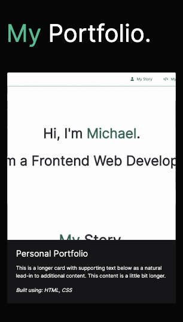

# Portfolio Website | Bootstrap 4.4
## Description

To familiarise myself with the Bootstrap Framework, I recreated my portfolio website while limiting the use of media queries, and I decided to go with a dark aesthetic and a 'moody' design. In order to achieve this, I learned how to add a 'parallax' effect and a smoke animation. I included a couple hover effects to highlight several features, buttons, or links.

Summary:
 
* There is a navigation bar with a dropdown that allows you to access my portfolio projects and links to the appropriate sections
* A hero/jumbotron section highlighting my name and a compressed image
* Each project is described in the portfolio section using bootstrap cards and grid
* The skills I expect to learn are displayed with Iconify Icons
* Contact information is included in the same row as the about me section
* The contact section displays my socials with Font Awesome icons
* The footer is kept minimal to keep inlign with the design

[Live Website](https://mdyeates.github.io/Bootstrap-Portfolio)

## Installation

N/A

## Usage

Users can access this website on smaller devices as I have used a reactive Bootstrap Grid. Furthermore, I have removed the background images and animations on mobiles to improve speed.

Below you can see my website on a mobile:

## Credits and Resources

[Font Awesome (Icons)](https://fontawesome.com/)

[Iconify Icons](https://iconify.design/)

[Bootstrap 4.4 Docs](https://getbootstrap.com/docs/4.4/getting-started/introduction/)

[Bootstrap 4 Grid](https://uxplanet.orghow-the-bootstrap-4-grid-works-a1b04703a3b7)

[CSS Tricks](https://css-tricks.com/)

[Hacker Themes Cheatsheet](https://hackerthemes.com/bootstrap-cheatsheet/)

[Create your design system](https://medium.com/codyhouse/create-your-design-system-part-1-typography-7c630d9092bd)

## Contact

## License

For more information, please refer to the LICENSE in the repo.
